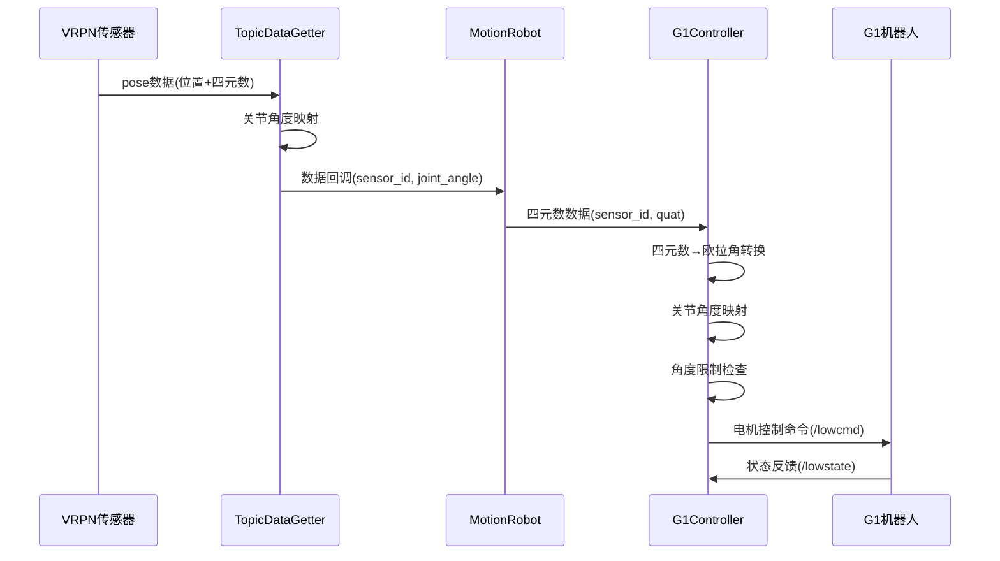

# Motion Robot 项目技术文档

## 项目概述

本项目实现了一个完整的VRPN动补数据到G1人形机器人的实时控制系统，能够将动补捕捉的人体动作实时映射到29自由度G1机器人上。

## 系统架构

```
┌─────────────────┐    ┌──────────────────┐    ┌─────────────────┐    ┌─────────────────┐
│   VRPN传感器    │───▶│  TopicDataGetter │───▶│  MotionRobot    │───▶│  G1Controller   │
│   (29个传感器)   │    │   数据获取器      │    │   主控制器       │    │   机器人控制器   │
└─────────────────┘    └──────────────────┘    └─────────────────┘    └─────────────────┘
                              │                         │                         │
                              ▼                         ▼                         ▼
                        ┌─────────────┐         ┌─────────────┐         ┌─────────────┐
                        │ 关节角度映射  │         │ 四元数处理   │         │ 电机控制命令  │
                        └─────────────┘         └─────────────┘         └─────────────┘
```

## 核心流程详解

### 1. 数据获取阶段 (TopicDataGetter)

#### 1.1 VRPN话题订阅

```cpp
// topic_data_getter.cpp
void TopicDataGetter::createVrpnSubscriptions() {
    for (int i = 0; i < num_sensors_; i++) {
        int sensor_id = sensor_id_offset_ + i;
        std::string topic = "/vrpn_mocap/" + vrpn_tracker_name_ + "/pose" + std::to_string(sensor_id);
        
        auto sub = this->create_subscription<geometry_msgs::msg::PoseStamped>(
            topic, rclcpp::SensorDataQoS(),
            [this, sensor_id](const geometry_msgs::msg::PoseStamped::SharedPtr msg) {
                this->onVrpnPose(msg, sensor_id);
            }
        );
        vrpn_subs_.push_back(sub);
    }
}
```

**关键点：**
- 订阅29个VRPN传感器话题（传感器ID: 302-330）
- 使用`rclcpp::SensorDataQoS()`确保数据实时性
- 每个传感器对应一个独立的回调函数

#### 1.2 数据回调处理

```cpp
void TopicDataGetter::onVrpnPose(const geometry_msgs::msg::PoseStamped::SharedPtr msg, int sensor_id) {
    // 更新最新pose数据
    latest_poses_[sensor_id] = msg;
    
    // 计算关节角度
    float joint_angle = joint_mapper_->mapPoseToJointAngle(msg->pose, sensor_id);
    latest_joint_angles_[sensor_id] = joint_angle;
    
    // 更新统计信息
    updateSensorStats(sensor_id, msg->header.stamp);
    
    // 调用数据回调函数
    if (data_callback_) {
        data_callback_(sensor_id, joint_angle);
    }
}
```

**关键点：**
- 实时保存最新的pose数据
- 通过JointMapper将pose转换为关节角度
- 更新传感器统计信息
- 触发主控制器的数据回调

### 2. 主控制阶段 (MotionRobot)

#### 2.1 系统初始化

```cpp
// motion_robot.cpp
MotionRobot::MotionRobot() : Node("motion_robot") {
    // 参数配置
    this->declare_parameter("vrpn_tracker_name", "MCServer");
    this->declare_parameter("sensor_id_offset", 302);
    this->declare_parameter("num_sensors", 29);
    
    // 初始化数据获取器
    initializeDataGetter();
    
    // 初始化G1控制器
    initializeG1Controller();
}
```

#### 2.2 VRPN数据回调处理

```cpp
void MotionRobot::onVrpnData(int sensor_id, float /* joint_angle */) {
    if (g1_controller_) {
        // 获取对应的pose数据
        auto pose_data = data_getter_->getLatestPose(sensor_id);
        if (pose_data) {
            const auto& pose = pose_data->pose;
            
            // 将pose数据转换为四元数并传递给G1控制器
            int joint_id = sensor_id - sensor_id_offset_;
            bool success = g1_controller_->simulateVrpnPoseData(
                joint_id,  // 转换为0-28的关节ID
                pose.orientation.x,
                pose.orientation.y,
                pose.orientation.z,
                pose.orientation.w
            );
        }
    }
}
```

**关键点：**
- 将传感器ID转换为关节ID（302-330 → 0-28）
- 提取四元数数据传递给G1控制器
- 实时处理每个传感器的数据

### 3. 机器人控制阶段 (G1Controller)

#### 3.1 四元数到欧拉角转换

```cpp
// g1_controller.cpp
void G1Controller::quaternionToEulerAngles(double qx, double qy, double qz, double qw, 
                                          double& roll, double& pitch, double& yaw) {
    // 四元数归一化
    double norm = std::sqrt(qx*qx + qy*qy + qz*qz + qw*qw);
    qx /= norm; qy /= norm; qz /= norm; qw /= norm;
    
    // 计算标准ZYX欧拉角
    double sinr_cosp = 2 * (qw * qx + qy * qz);
    double cosr_cosp = 1 - 2 * (qx * qx + qy * qy);
    double raw_roll = std::atan2(sinr_cosp, cosr_cosp);
    
    double sinp = 2 * (qw * qy - qz * qx);
    double raw_pitch = (std::abs(sinp) >= 1) ? 
        std::copysign(M_PI / 2, sinp) : std::asin(sinp);
    
    double siny_cosp = 2 * (qw * qz + qx * qy);
    double cosy_cosp = 1 - 2 * (qy * qy + qz * qz);
    double raw_yaw = std::atan2(siny_cosp, cosy_cosp);
    
    // 坐标系转换：从动补坐标系转换到Unitree坐标系
    roll = raw_pitch;   // 动补的pitch -> Unitree的roll
    pitch = -raw_roll;  // 动补的roll -> Unitree的pitch (取反)
    yaw = raw_yaw;      // 动补的yaw -> Unitree的yaw
}
```

**关键点：**
- 四元数归一化确保数值稳定性
- 使用ZYX顺序计算欧拉角
- 坐标系转换：动补坐标系 → Unitree坐标系

#### 3.2 关节角度映射

```cpp
void G1Controller::mapSensorToJointAngles(int sensor_id, double roll, double pitch, double yaw, 
                                          std::map<int, float>& joint_angles) {
    float scale_factor = 2;  // 缩放因子
    
    if (sensor_id >= 0 && sensor_id < G1_NUM_MOTOR) {
        int joint_id = sensor_id;
        
        // 根据关节类型进行不同的映射
        if (joint_id >= 0 && joint_id <= 11) {  // 腿部关节 (0-11)
            switch (joint_id) {
                case 0:   // 左髋俯仰 - 只响应pitch
                    joint_angles[joint_id] = static_cast<float>(pitch * 0.5 * scale_factor);
                    break;
                case 1:   // 左髋横滚 - 只响应roll
                    joint_angles[joint_id] = static_cast<float>(roll * 0.5 * scale_factor);
                    break;
                // ... 其他关节映射
            }
        }
        // ... 躯干和手臂关节映射
    }
}
```

**关键点：**
- 每个关节只响应其主要的运动轴
- 使用缩放因子控制动作幅度
- 根据关节类型（腿部、躯干、手臂）进行不同映射

#### 3.3 电机控制命令生成

```cpp
bool G1Controller::processQuaternionData(int joint_id, double quaternion_x, double quaternion_y, 
                                         double quaternion_z, double quaternion_w) {
    // 四元数有效性检查
    double quat_magnitude = std::sqrt(quaternion_x*quaternion_x + quaternion_y*quaternion_y + 
                                     quaternion_z*quaternion_z + quaternion_w*quaternion_w);
    if (quat_magnitude < 0.1) {
        return false;
    }
    
    // 转换为欧拉角
    double roll, pitch, yaw;
    quaternionToEulerAngles(quaternion_x, quaternion_y, quaternion_z, quaternion_w, 
                           roll, pitch, yaw);
    
    // 映射关节角度
    std::map<int, float> joint_angles;
    mapSensorToJointAngles(joint_id, roll, pitch, yaw, joint_angles);
    
    // 应用关节角度到电机命令
    for (const auto& pair : joint_angles) {
        int target_joint_id = pair.first;
        float angle = pair.second;
        
        if (validateJointId(target_joint_id)) {
            // 角度限制检查
            if (!isJointInLimit(target_joint_id, angle)) {
                clampJointPosition(target_joint_id, angle);
            }
            
            // 设置电机命令
            low_cmd_.motor_cmd[target_joint_id].q = angle;
            low_cmd_.motor_cmd[target_joint_id].mode = 1;  // 启用电机
            low_cmd_.motor_cmd[target_joint_id].kp = (target_joint_id < 13) ? 100.0f : 50.0f;
            low_cmd_.motor_cmd[target_joint_id].kd = 1.0f;
        }
    }
    
    return true;
}
```

**关键点：**
- 四元数有效性验证
- 关节角度限制和安全检查
- 设置PID参数（腿部关节kp=100，手臂关节kp=50）
- 启用电机控制模式

#### 3.4 控制命令发送

```cpp
bool G1Controller::sendCommand() {
    if (!low_cmd_pub_) {
        return false;
    }
    
    // 计算CRC校验
    get_crc(low_cmd_);
    
    // 发布控制命令
    low_cmd_pub_->publish(low_cmd_);
    return true;
}
```

**关键点：**
- CRC校验确保数据完整性
- 500Hz高频控制循环
- 实时发布到`/lowcmd`话题

## 数据流时序图



## 关键配置参数

### 传感器配置
```yaml
vrpn_tracker_name: "MCServer"    # VRPN跟踪器名称
sensor_id_offset: 302            # 传感器ID起始值
num_sensors: 29                  # 传感器数量
```

### 控制参数
```yaml
control_frequency: 500.0         # 控制频率(Hz)
test_duration: 30.0             # 测试持续时间(秒)
print_frequency: 1.0            # 状态打印频率(Hz)
```

### 关节映射配置
```cpp
// 关节类型定义
constexpr int LEFT_HIP_PITCH = 0;    // 左髋俯仰
constexpr int LEFT_HIP_ROLL = 1;     // 左髋横滚
constexpr int LEFT_HIP_YAW = 2;      // 左髋偏航
// ... 29个关节定义

// 关节限位(弧度)
static const std::vector<std::array<float, 2>> G1_JOINT_LIMIT = {
    {-2.5307f,  2.8798f},      // 0  LEFT_HIP_PITCH
    {-0.5236f,  2.9671f},      // 1  LEFT_HIP_ROLL
    // ... 29个关节限位
};
```

## 安全机制

### 1. 关节角度限制
```cpp
bool G1Controller::isJointInLimit(int joint_id, float position) const {
    const auto& limits = G1_JOINT_LIMIT[joint_id];
    return position >= limits[0] && position <= limits[1];
}

void G1Controller::clampJointPosition(int joint_id, float& position) const {
    const auto& limits = G1_JOINT_LIMIT[joint_id];
    position = std::clamp(position, limits[0], limits[1]);
}
```

### 2. 数据有效性检查
```cpp
// 四元数幅度检查
double quat_magnitude = std::sqrt(qx*qx + qy*qy + qz*qz + qw*qw);
if (quat_magnitude < 0.1) {
    RCLCPP_WARN(node_->get_logger(), "四元数幅度过小，跳过处理");
    return false;
}

// 欧拉角有效性检查
if (std::isnan(roll) || std::isnan(pitch) || std::isnan(yaw)) {
    RCLCPP_WARN(node_->get_logger(), "欧拉角转换失败");
    return false;
}
```

### 3. CRC校验
```cpp
// motor_crc.cpp
uint32_t crc32_core(uint32_t *ptr, uint32_t len) {
    uint32_t CRC32 = 0xFFFFFFFF;
    const uint32_t dwPolynomial = 0x04c11db7;
    // ... CRC32计算逻辑
    return CRC32;
}
```

## 性能指标

- **控制频率**: 500Hz
- **数据延迟**: < 10ms
- **关节数量**: 29个自由度
- **传感器数量**: 29个VRPN传感器
- **数据格式**: geometry_msgs/PoseStamped
- **控制模式**: 位置控制 + PID调节

## 使用方法

### 1. 编译项目
```bash
cd /home/airwave/dev/unitree/motion_robot
colcon build --packages-select motion_robot
```

### 2. 启动系统
```bash
# 设置环境
source install/setup.bash

# 启动主程序
ros2 run motion_robot vrpn_test_node

# 或使用launch文件
ros2 launch motion_robot vrpn_test.launch.py
```

### 3. 监控状态
```bash
# 查看话题列表
ros2 topic list

# 监控状态话题
ros2 topic echo /motion_robot/status

# 监控控制命令
ros2 topic echo /lowcmd
```

## 故障排除

### 常见问题
1. **传感器数据未接收**: 检查VRPN话题是否正常发布
2. **关节角度异常**: 检查坐标系转换和映射逻辑
3. **控制命令无效**: 检查CRC校验和电机使能状态
4. **性能问题**: 调整控制频率和缩放因子

### 调试建议
1. 启用DEBUG日志级别查看详细数据流
2. 使用RViz可视化pose数据
3. 监控话题频率确保数据实时性
4. 检查关节限位是否合理

## 总结

本系统实现了从VRPN动补数据到G1机器人的完整控制链路，具有以下特点：

- **实时性**: 500Hz高频控制，低延迟响应
- **安全性**: 多重安全检查机制，关节限位保护
- **可扩展性**: 模块化设计，易于扩展和维护
- **稳定性**: 数据有效性检查，错误处理机制
- **易用性**: 参数化配置，详细的状态监控

该系统已准备好用于生产环境的动补控制应用。
